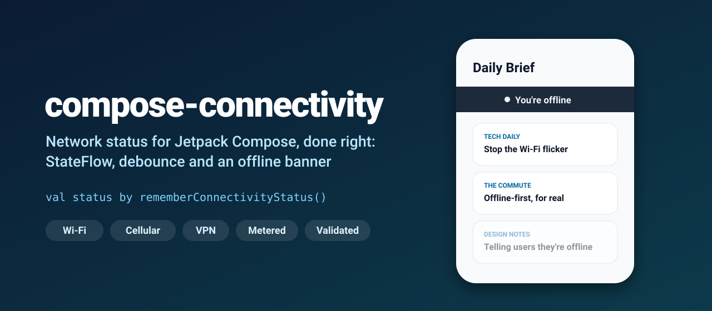
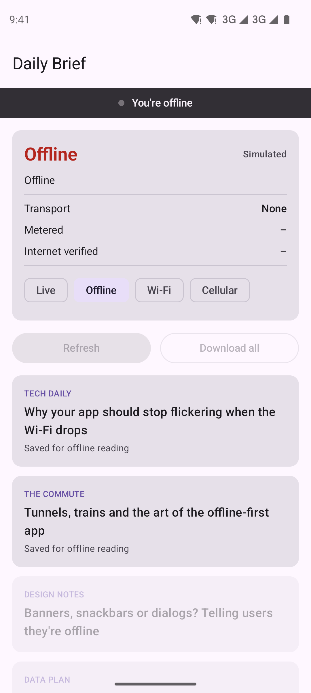
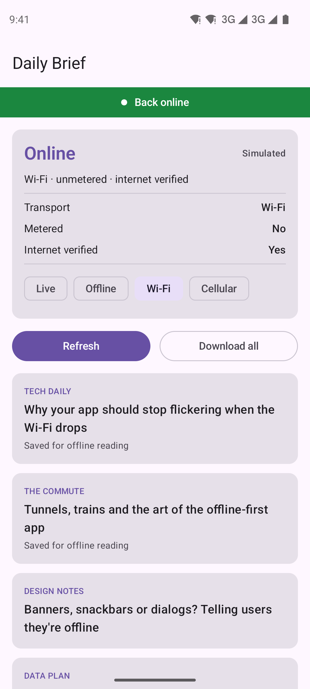
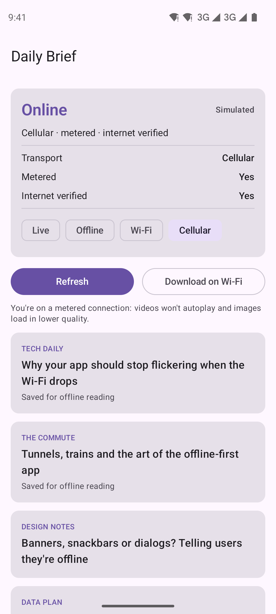
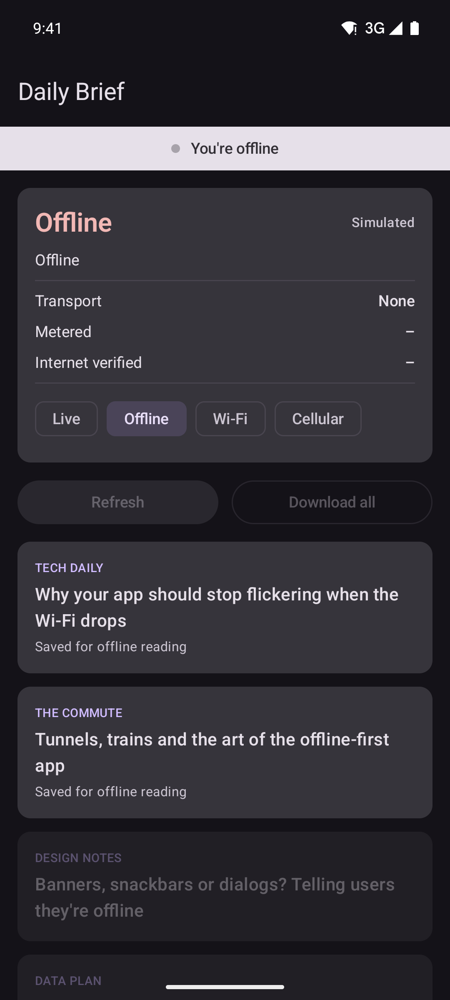

<p align="center">
  
</p>

<p align="center">
  <a href="https://github.com/halilozel1903/compose-connectivity/actions/workflows/ci.yml"></a>
  <a href="https://jitpack.io/#halilozel1903/compose-connectivity"></a>
  
  
  
  <a href="LICENSE"></a>
</p>

**compose-connectivity** is network connectivity for Jetpack Compose, done right. A `StateFlow` built on `ConnectivityManager.registerDefaultNetworkCallback` tells you whether the device is online, over which transport, whether the network is metered and whether the system verified internet access. It is debounced, so a flaky network or a Wi-Fi to cellular handover doesn't make your UI flicker, and it comes with an animated "You're offline" / "Back online" banner.

```kotlin
val status by rememberConnectivityStatus()

Button(onClick = ::refresh, enabled = status.isOnline) { Text("Refresh") }
if (status.isMetered) Text("Saving data on a metered connection")
```

## Screenshots

Captured from the sample app on an Android emulator by CI.

| Offline | Back online | Metered (cellular) | Dark mode |
| :---: | :---: | :---: | :---: |
|  |  |  |  |

## Why

Most connectivity helpers still use the deprecated `activeNetworkInfo`, register a callback per screen and never unregister it, or flip the UI to "offline" for half a second every time the phone moves from Wi-Fi to cellular. compose-connectivity listens to the **default network** only (the one your requests actually use), shares one callback per process, stops listening when nobody collects, and smooths out short drops.

## Features

- 📡 **`ConnectivityMonitor`** with a `StateFlow<ConnectivityStatus>`, built on `registerDefaultNetworkCallback` with `callbackFlow` and `stateIn`.
- 🚦 **Rich status**: `Available`, `Losing` (handover in progress) and `Unavailable`, with transports (Wi-Fi, cellular, ethernet, VPN, Bluetooth), metered and validated-internet flags.
- 🧘 **Debounced**: going offline must last 1 s and coming back 500 ms before the UI hears about it. Both are configurable.
- 🪧 **`ConnectivityBanner`**: animated "You're offline" banner that turns into "Back online" and hides itself after 3 s.
- 🧩 **Compose helpers**: `rememberConnectivityStatus()`, the `OfflineAware { status -> }` wrapper and `Modifier.offlineAware(status)` to dim and block network-only actions.
- 🔋 **Lifecycle aware**: one callback per process, released 5 s after the last collector stops (for example when the app goes to the background).
- 🧪 **Pure Kotlin core** (`connectivity-core`): event reducer, debounce and banner state machine, unit tested with virtual time. `FakeConnectivityMonitor` for tests, previews and screenshots.

## Installation

Add JitPack to `settings.gradle.kts`:

```kotlin
dependencyResolutionManagement {
    repositories {
        google()
        mavenCentral()
        maven("https://jitpack.io")
    }
}
```

Then the dependency:

```kotlin
dependencies {
    implementation("com.github.halilozel1903.compose-connectivity:connectivity:1.0.0")
    // Pure Kotlin model, debounce and banner logic only (for JVM/KMP modules):
    // implementation("com.github.halilozel1903.compose-connectivity:connectivity-core:1.0.0")
}
```

> The build is also set up for Maven Central (`io.github.halilozel1903:connectivity`) via the vanniktech publish plugin.

The library's manifest already declares `ACCESS_NETWORK_STATE`, a normal permission that needs no runtime prompt.

## Quick start

**Show a banner and react to the status**

```kotlin
@Composable
fun FeedScreen() {
    Scaffold(topBar = { TopAppBar(title = { Text("Feed") }) }) { padding ->
        OfflineAware(Modifier.padding(padding)) { status ->
            Feed(
                canRefresh = status.isOnline,
                autoplayVideos = !status.isMetered,
            )
        }
    }
}
```

**Or place the pieces yourself**

```kotlin
Column {
    ConnectivityBanner()                          // slides in and out on its own
    val status by rememberConnectivityStatus()
    OutlinedButton(
        onClick = ::downloadAll,
        modifier = Modifier.offlineAware(status), // dimmed, touches blocked while offline
    ) { Text("Download all") }
}
```

**Outside Compose (ViewModel, repository, WorkManager)**

```kotlin
class FeedViewModel(app: Application) : AndroidViewModel(app) {
    val status: StateFlow<ConnectivityStatus> = app.connectivityMonitor().status

    init {
        viewModelScope.launch {
            status.filter { it.isOnline }.collect { syncPendingChanges() }
        }
    }
}
```

## The status

```kotlin
when (status) {
    is ConnectivityStatus.Available -> status.details   // transports, isMetered, isValidated
    is ConnectivityStatus.Losing -> status.maxMsToLive  // still works, handover in progress
    ConnectivityStatus.Unavailable -> Unit
}
```

| Property | Meaning |
| --- | --- |
| `isOnline` / `isOffline` | There is a usable default network (`Losing` counts as online) |
| `transport` | `Wifi`, `Cellular`, `Ethernet`, `Vpn`, `Bluetooth` or `Other`; VPN wins over the underlying one |
| `details.transports` | All transports, for example `[Vpn, Wifi]` |
| `isMetered` | Online over a metered network (temporarily unmetered 5G counts as unmetered on API 30+) |
| `isValidated` | The system verified internet access; `false` behind captive portals |
| `describe()` | `Wi-Fi · unmetered · internet verified` |

## Configuration

```kotlin
val monitor = AndroidConnectivityMonitor(
    context = context,
    config = ConnectivityConfig(
        offlineDelay = 2.seconds,          // how long a drop must last to be reported
        onlineDelay = 300.milliseconds,    // how long a reconnect must last to be reported
        requireValidatedInternet = true,   // captive portals count as offline
    ),
)

CompositionLocalProvider(LocalConnectivityMonitor provides monitor) {
    App()   // every rememberConnectivityStatus() and ConnectivityBanner below uses it
}
```

`requireValidatedInternet` is off by default because some networks block the system's connectivity check while the internet works fine.

The banner can be customized too:

```kotlin
ConnectivityBanner(
    backOnlineDuration = 5.seconds,
    offlineText = stringResource(R.string.offline),
    backOnlineText = stringResource(R.string.back_online),
    colors = ConnectivityBannerDefaults.colors(offlineContainer = MaterialTheme.colorScheme.error),
)
```

## Testing and previews

Provide a `FakeConnectivityMonitor` and drive it by hand:

```kotlin
val fake = FakeConnectivityMonitor(ConnectivityStatus.Unavailable)
composeRule.setContent {
    CompositionLocalProvider(LocalConnectivityMonitor provides fake) { FeedScreen() }
}
composeRule.onNodeWithText("You're offline").assertIsDisplayed()
fake.goOnline(NetworkDetails.Cellular)
```

`@Preview`s get a fake online monitor automatically. The logic itself lives in `connectivity-core` and is plain Kotlin:

```kotlin
@Test
fun `short drop is swallowed`() = runTest {
    val statuses = flow {
        emit(wifi); delay(100); emit(offline); delay(300); emit(wifi)
    }.debounceConnectivity(offlineDelay = 1.seconds, onlineDelay = 500.milliseconds).toList()

    assertEquals(listOf(wifi), statuses)
}
```

## Sample app

The `sample` module is a small news reader. It shows the banner, a live status card, network-only actions and articles saved for offline reading. Chips on the status card switch between the live network and simulated states.

Emulator networking can't be toggled reliably, so the sample also accepts a fake status at launch (used by `scripts/screenshots.sh`):

```bash
./gradlew :sample:installDebug
adb shell am start -n io.github.halilozel1903.connectivity.sample/.MainActivity --es fakeStatus offline
```

`fakeStatus` is one of `offline`, `online`, `metered`, `vpn` or `reconnected` (starts offline and comes back after 1.5 s).

## Project structure

| Module | What it is |
| --- | --- |
| `connectivity-core` | Pure Kotlin: status model, event reducer, debounce, banner state machine, fake monitor |
| `connectivity` | Android: `AndroidConnectivityMonitor`, Compose APIs and the banner |
| `sample` | A news reader that shows everything, with fake statuses for screenshots |

## Tech stack

Kotlin 2.4 · AGP 9.4 with built-in Kotlin · Gradle 9.6 · Jetpack Compose (BOM 2026.09) · Material 3 · Coroutines & Flow · Lifecycle Compose · GitHub Actions

## License

MIT. See [LICENSE](LICENSE).
